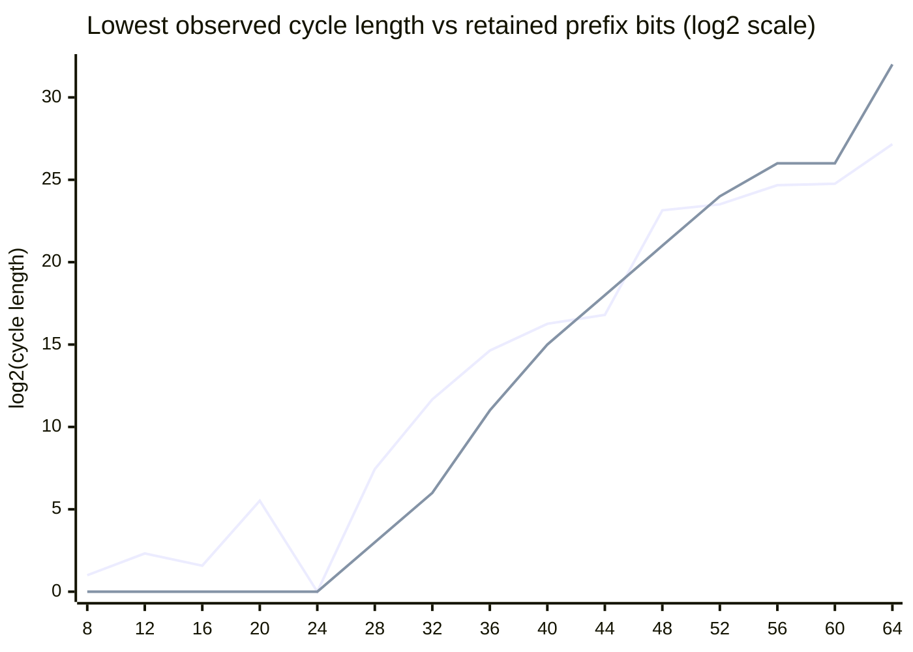

# hash-loop

Search for cycles in the repeated SHA-1 mapping. By default, each state keeps the first 32 SHA-1 bits and zeroes the rest, making the cycle search practical. Use `--bits 160` to search the full SHA-1 state space; a generic full-state cycle is expected to require about $2^{80}$ hash evaluations.

Known SHA-1 collision attacks do not directly produce an iteration cycle. They find two different messages with the same digest, while a cycle requires a state to eventually return to itself. The reduced state search below uses the same birthday-bound idea while preserving a deterministic SHA-1 transition.

## Usage

```
hash-loop 0.1.0
Search for cycles in the repeated SHA-1 mapping

USAGE:
    hash-loop.exe [FLAGS] [OPTIONS] [max]

FLAGS:
    -h, --help       Prints help information
    -V, --version    Prints version information
    -v               Switch on verbosity

OPTIONS:
    --bits <bits>      Number of leading SHA-1 bits retained in each state [default: 32]
    --trials <trials>  Number of independent seeds to test [default: 1]

ARGS:
    <max>    Maximum search length, positive integer [default: 4294967296]
```

Run the practical search in release mode:

```
cargo run --release -- --bits 32
```

Use `--trials` to keep several independent walks and report the shortest cycle found:

```
cargo run --release -- --bits 32 --trials 100
```

## Lowest Observed Cycles

The table below keeps the shortest cycle observed for each prefix width. These are empirical minima from the release runs documented below, not guaranteed global minima.

| Prefix bits | Shortest witness | Cycle length |
| ---: | --- | ---: |
| 8 | `DA00000000000000000000000000000000000000` | 2 |
| 12 | `D110000000000000000000000000000000000000` | 5 |
| 16 | `9F0B000000000000000000000000000000000000` | 3 |
| 20 | `AF2B100000000000000000000000000000000000` | 46 |
| 24 | `CFE4090000000000000000000000000000000000` | 1 |
| 28 | `AB0ECCA000000000000000000000000000000000` | 174 |
| 32 | `98B89F7C00000000000000000000000000000000` | 3,251 |
| 36 | `447749A1D0000000000000000000000000000000` | 25,246 |
| 40 | `80C9C161F0000000000000000000000000000000` | 78,056 |
| 44 | `952C63910B200000000000000000000000000000` | 113,754 |
| 48 | `AE3CFD6E5B7E0000000000000000000000000000` | 9,288,468 |
| 52 | `0AB09B1B0E669000000000000000000000000000` | 11,941,080 |
| 56 | `993281530F32BA00000000000000000000000000` | 26,621,020 |
| 60 | `8A0273C0DEDDF0F0000000000000000000000000` | 28,438,441 |
| 64 | `BE5E52F3CFD5F6E4000000000000000000000000` | 149,463,600 |

## Bits vs. Cycle Length

Cycle lengths above span roughly 8 orders of magnitude, so the chart below plots $\log_2(\text{cycle length})$ against retained prefix bits. Each table entry is the minimum over `T` independent random walks (Rayon trials), so a flat $\text{bits}/2$ line overstates the expected minimum. If $P(\text{length} \le x) \approx x / 2^{\text{bits}/2}$ near the origin, the minimum of `T` samples scales as $2^{\text{bits}/2} / T$, i.e. $\log_2(\text{cycle length}) \approx \text{bits}/2 - \log_2(T)$ (clamped at 0). The reference line below uses the trial count that produced each table entry: 4096 trials for 8-24 bits, tapering down to 1 trial at 64 bits. Mermaid has no dedicated scatter/dot chart type, so `xychart-beta` `line` is used; each data point is still rendered as a marker.



This trial-adjusted reference sits at or below the observed minimum for most widths, unlike the flat $\text{bits}/2$ line it replaces. It sits slightly above the data at 44-60 bits (sampling noise from very few trials) and meets it exactly at 64 bits, where the single completed random walk used for the chart is still the shortest of the two successful 64-bit searches on record: a follow-up 8-trial search completed with a much longer cycle (length 1,525,552,541), reinforcing that shorter completed walks are somewhat favored just by having finished within the practical execution window. A 68-bit probe has not yet completed within that window.
