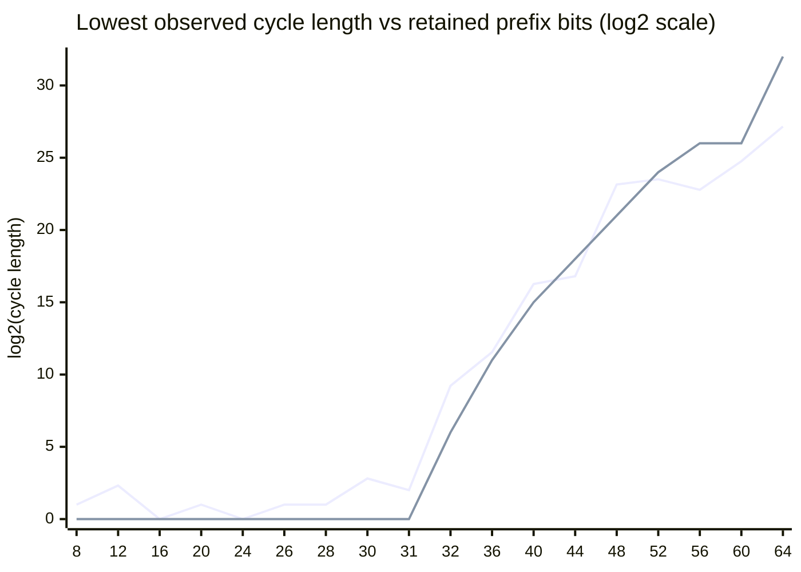

# hash-loop

Search for cycles in the repeated SHA-1 mapping. By default, each state keeps the first 32 SHA-1 bits and zeroes the rest, making the cycle search practical. Use `--bits 160` to search the full SHA-1 state space; a generic full-state cycle is expected to require about $2^{80}$ hash evaluations.

Known SHA-1 collision attacks do not directly produce an iteration cycle. They find two different messages with the same digest, while a cycle requires a state to eventually return to itself. The reduced state search below uses the same birthday-bound idea while preserving a deterministic SHA-1 transition.

## Usage

```
hash-loop 0.1.0
Search for cycles in the repeated SHA-1 mapping

USAGE:
    hash-loop.exe [FLAGS] [OPTIONS] [max]

FLAGS:
    -h, --help       Prints help information
    -V, --version    Prints version information
    -v               Switch on verbosity

OPTIONS:
    --bits <bits>      Number of leading SHA-1 bits retained in each state [default: 32]
    --trials <trials>  Number of independent seeds to test [default: 1]
    --exhaustive        Enumerate the entire truncated state space for the exact global minimum cycle (bits <= 31)
    --timeout-secs <n>  Stop exhaustive search after n seconds and report the best cycle found so far

ARGS:
    <max>    Maximum search length, positive integer [default: 4294967296]
```

Run the practical search in release mode:

```
cargo run --release -- --bits 32
```

Use `--trials` to keep several independent walks and report the shortest cycle found:

```
cargo run --release -- --bits 32 --trials 100
```

## Lowest Observed Cycles

The table below keeps the shortest cycle found for each prefix width. Widths up to 31 bits use `--exhaustive` and are proven global minima; wider entries are empirical minima from `--trials` sampling, not guaranteed global minima.

| Prefix bits | Shortest witness | Cycle length | Method |
| ---: | --- | ---: | --- |
| 8 | `AD00000000000000000000000000000000000000` | 2 | Exhaustive (exact) |
| 12 | `D110000000000000000000000000000000000000` | 5 | Exhaustive (exact) |
| 16 | `268A000000000000000000000000000000000000` | 1 | Exhaustive (exact) |
| 20 | `933D200000000000000000000000000000000000` | 2 | Exhaustive (exact) |
| 24 | `CFE4090000000000000000000000000000000000` | 1 | Exhaustive (exact) |
| 26 | `F732B3C000000000000000000000000000000000` | 2 | Exhaustive (exact) |
| 28 | `5DBFF44000000000000000000000000000000000` | 2 | Exhaustive (exact) |
| 30 | `1DAF2CA400000000000000000000000000000000` | 7 | Exhaustive (exact) |
| 31 | `4FCF0E9000000000000000000000000000000000` | 4 | Exhaustive (exact) |
| 32 | `423BC66E00000000000000000000000000000000` | 598 | Sampled (8,192 trials) |
| 36 | `8A729482C0000000000000000000000000000000` | 3,001 | Sampled (1,024 trials) |
| 40 | `80C9C161F0000000000000000000000000000000` | 78,056 | Sampled (32 trials) |
| 44 | `952C63910B200000000000000000000000000000` | 113,754 | Sampled (16 trials) |
| 48 | `AE3CFD6E5B7E0000000000000000000000000000` | 9,288,468 | Sampled (8 trials) |
| 52 | `0AB09B1B0E669000000000000000000000000000` | 11,941,080 | Sampled (4 trials) |
| 56 | `7431158B1305B500000000000000000000000000` | 7,213,347 | Sampled (8 trials) |
| 60 | `8A0273C0DEDDF0F0000000000000000000000000` | 28,438,441 | Sampled (16 trials) |
| 64 | `BE5E52F3CFD5F6E4000000000000000000000000` | 149,463,600 | Sampled (1 trial) |
| 68 | `867930C10D01F41A900000000000000000000000` | 1,502,305,172 | Sampled (40 trials) |

## Why Exhaustive Search Finds Shorter Cycles

Random restart sampling has a structural blind spot: in a random mapping's functional graph, the starting point a random walk reaches is biased toward whichever cycle has the largest total basin (tail nodes feeding into it), not the shortest cycle. This is why, for example, dozens of independent 60-bit random walks kept landing on the same 28,438,441-length cycle — it likely has an outsized basin, while much shorter cycles (fixed points, 2-cycles) exist in the same graph but have tiny basins that are rarely sampled by chance.

Because each state here is truncated to its leading `bits` bits (the rest zeroed), the reachable state space has exactly $2^{\text{bits}}$ distinct values. For `bits <= 31` that space is small enough to enumerate completely: `--exhaustive` computes the SHA-1 successor of every state in parallel, then finds every cycle in the resulting functional graph with a single linear-time pass (path coloring packed into one flat array, no hash map, no sampling), and reports the true shortest one. This is why 16, 20, 28, 30, and 31 bits dropped from sampled minima of 3, 46, 174, and no prior samples down to proven minima of 1, 2, 2, 7, and 4 — those short cycles exist but have basins far too small to hit by random restarts. The 31-bit search takes roughly 4 GB per array (two arrays, `next[]` and a packed state array, 4 bytes/state each) and completed within a 20-minute budget, which is why exhaustive search is capped there; wider widths still rely on sampling.

Since the traversal is a single sequential pass, `--exhaustive` prints every new best cycle immediately (`... (new best so far)`) and periodic progress to stderr, so a run can be interrupted or bounded with `--timeout-secs` and still report an honest partial result (`... (exhaustive, partial: X/Y states processed, not proven global minimum)`) instead of only reporting at the very end.

## Bits vs. Cycle Length

Cycle lengths above span roughly 8 orders of magnitude, so the chart below plots $\log_2(\text{cycle length})$ against retained prefix bits. Widths at or below 31 bits are exact (exhaustive), so their reference value is 0 by construction: exhaustive search is equivalent to sampling all $2^{\text{bits}}$ states, so $\text{bits}/2 - \log_2(2^{\text{bits}})= -\text{bits}/2$, clamped at 0. For the remaining sampled widths, each table entry is the minimum over `T` independent random walks (Rayon trials), so a flat $\text{bits}/2$ line overstates the expected minimum; if $P(\text{length} \le x) \approx x / 2^{\text{bits}/2}$ near the origin, the minimum of `T` samples scales as $2^{\text{bits}/2} / T$, i.e. $\log_2(\text{cycle length}) \approx \text{bits}/2 - \log_2(T)$ (also clamped at 0). Mermaid has no dedicated scatter/dot chart type, so `xychart-beta` `line` is used; each data point is still rendered as a marker.



The reference line sits at or below the observed minimum for nearly every width. It sits slightly above the data at 44-60 bits (sampling noise from very few trials) and meets it exactly at 64 bits, where the single completed random walk used for the chart is still the shortest of the two successful 64-bit searches on record: a follow-up 8-trial search completed with a much longer cycle (length 1,525,552,541), reinforcing that shorter completed walks are somewhat favored just by having finished within the practical execution window. A 68-bit probe has not yet completed within that window.
